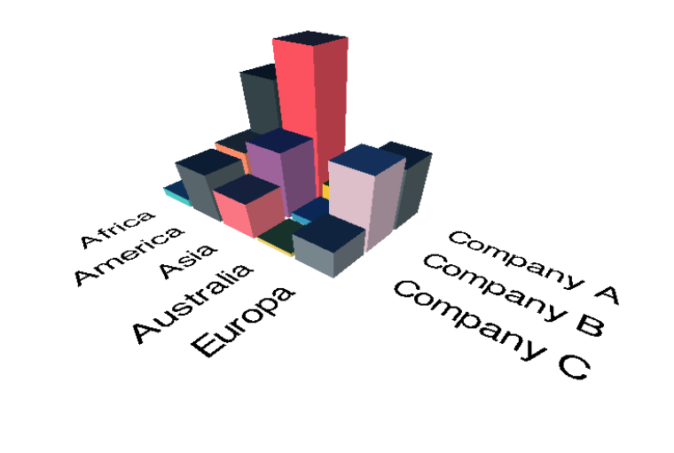

## Bar3D Visual

This repository contains the source codes of Power BI Custom Visual - 3D Bar Chart.

The visual groups data by two categories and visualizes values by drawing several bars into a 3d scene.

Where visual puts the first category at X axis and the second category at Y axis.

The value of group determines height of bar.

To start dev server and debug the visual
`npm run start`
To create package call
`npm run package`

`pbiviz start` or `pbiviz package` will not work

Roadmap:

* Implement labels as sprite of text
* Draw axises grids
* Save camera position
* Added PBI tooltips

License: MIT